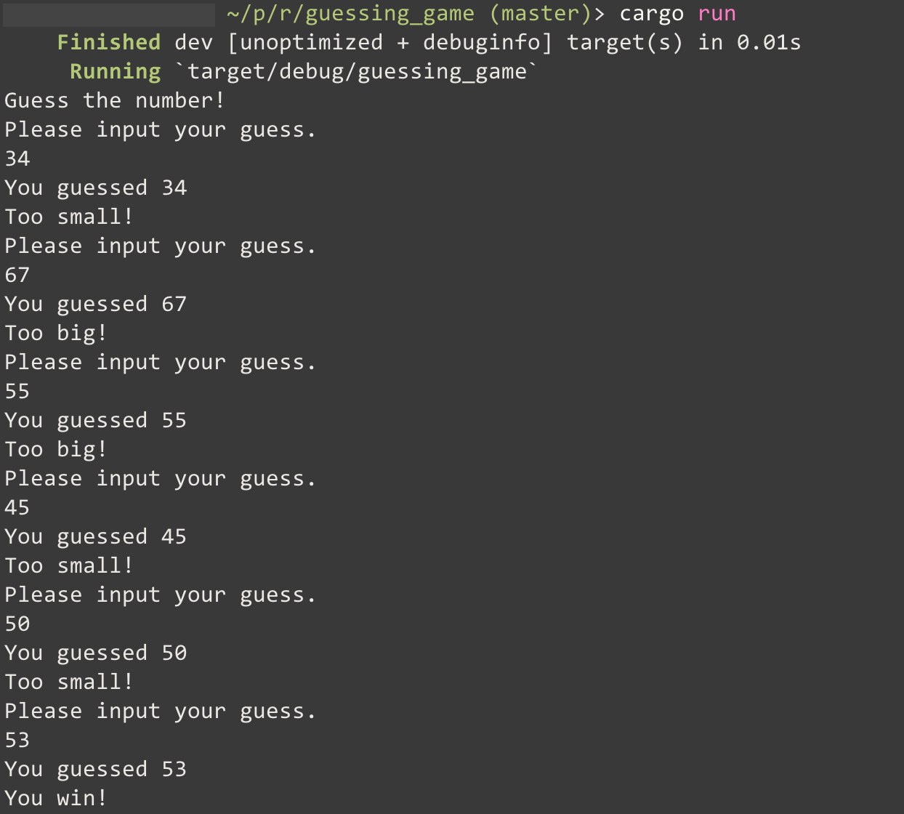

# Guessing Game

Classic number 'guessing game' in Rust.

Assuming you have both Rust and Cargo installed, to install this game:

```bash
$ git clone https://github.com/jelliston/guessing_game
$ cd guessing_game
$ cargo build
$ ./target/guessing_game
```
